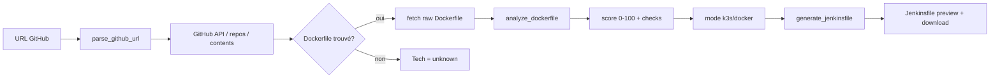

# AI GitOps — Modélisation

## 1. Objectif
Saisir une **URL GitHub**, détecter automatiquement la présence et la conformité du `Dockerfile`, puis générer un `Jenkinsfile` à partir de la base de connaissance en **2 modes** :

- **K3s** (`k3s`) : `docker build → push Harbor → kubectl apply` (Deployment + Service NodePort + HPA + Secret) — cf. `app.py:7` et `generate-deployment.sh:186`
- **Docker run** (`docker`) : `docker build → push Harbor → docker run` standalone (VM, sans K8s)

## 2. Architecture

```
ai-git-ops/
├── core/
│   ├── knowledge_base.json      # Règles tech (node/python/java/go) + templates modes
│   ├── github_detector.py       # parse_github_url(), detect_dockerfile(), fetch_file_content()
│   ├── dockerfile_analyzer.py   # analyze_dockerfile() -> score conformité
│   └── jenkins_generator.py     # generate_jenkinsfile(mode, app, port, envs)
├── app.py                       # Flask API: /api/analyze, /api/generate-jenkinsfile
├── templates/index.html         # UI : URL + token + port + env vars + mode selector
└── static/{style.css,script.js}
```

### Flux


## 3. Détection Dockerfile

`core/github_detector.py:18` :
- Parse `https://github.com/org/repo` (+ `.git`, `/tree/main`)
- Appelle `GET /repos/:owner/:repo` pour `default_branch`
- Cherche `Dockerfile`, `docker/Dockerfile`, `build/Dockerfile` via `/contents` puis fallback `raw.githubusercontent.com` HEAD
- `fetch_repo_file_list()` liste racine pour détection tech (`package.json`, `requirements.txt`...)

## 4. Analyse conformité

`core/dockerfile_analyzer.py:18` :

| Règle | Sévérité |
|-------|----------|
| `FROM` sans `:latest` | critical |
| `USER` non-root (`node`/`101`/`1000`) | critical/warning |
| `EXPOSE` présent et correspond à `PORT` | warning |
| `ARG PORT` | warning |
| Multi-stage `AS` | info |
| Pas de secrets en dur `ENV PASSWORD=...` | critical |

Score : `100 - 25*critical - 10*warning`. `compliant = critical==0 && score>=70`.

Tech détectée : `FROM node` / `python` / `eclipse-temurin` / `golang` ou `package.json` etc.

## 5. Génération Jenkinsfile

`core/jenkins_generator.py:12` + `knowledge_base.json:38` :

- **k3s** : `generate_k3s_jenkinsfile()` — env `REGISTRY=harbor.tsirylab.com`, `withCredentials(harbor-credentials, kubeconfig-jenkins)`, `docker build --build-arg`, `kubectl create secret docker-registry + generic`, `envsubst < k8s/... | kubectl apply`, `rollout status`
- **docker** : `generate_docker_jenkinsfile()` — même build/push puis `docker stop/rm`, `docker run -d --restart unless-stopped -p PORT:PORT -e VAR`

Env vars : `envs=[{name, secret_id}]` injectés en `withCredentials(string(...))` et `docker build --build-arg` / `kubectl create secret --from-literal`.

## 6. API

| Endpoint | Body | Réponse |
|----------|------|---------|
| `POST /api/analyze` | `{github_url, token?, port}` | `{repo, branch, language, dockerfile{found,path,raw_url}, analysis{technology,score,compliant,checks}}` |
| `POST /api/generate-jenkinsfile` | `{mode:"k3s"|"docker", github_url, app_name?, port, node_port, envs}` | `{jenkinsfile, docker_info}` |

## 7. Intégration avec générateur principal

- Standalone : `python ai-git-ops/app.py` → `http://localhost:5001`
- Intégré : depuis `D:\Devs\devsecops\app.py` ajouter :

```python
from ai_git_ops.app import app as ai_app  # ou blueprint
# ou enregistrer routes via:
# app.register_blueprint(ai_bp, url_prefix="/ai-git-ops")
```

Voir section 8 pour wiring proposé.

## 8. Lancement

```bash
pip install flask requests
python ai-git-ops/app.py          # 5001
# ou depuis racine:
python app.py                     # 5000 (générateur classique)
# les deux cohabitent
```

## 9. Exemples

- `https://github.com/nodejs/node` → Dockerfile `FROM ubuntu` → warning base image, score ~70
- Repo sans Dockerfile + `package.json` → tech `node`, Dockerfile manquant, génération proposée
- Privé : fournir `token ghp_xxx` (header `Authorization: token`)

## 10. Évolutions prévues

- HDOLint en lib au lieu de regex
- Cache Redis pour API GitHub
- Génération automatique `k8s/*.yaml` en plus du Jenkinsfile (mode k3s)
- Bouton "Créer PR" qui push `Jenkinsfile` sur branche `ci/add-jenkinsfile`
